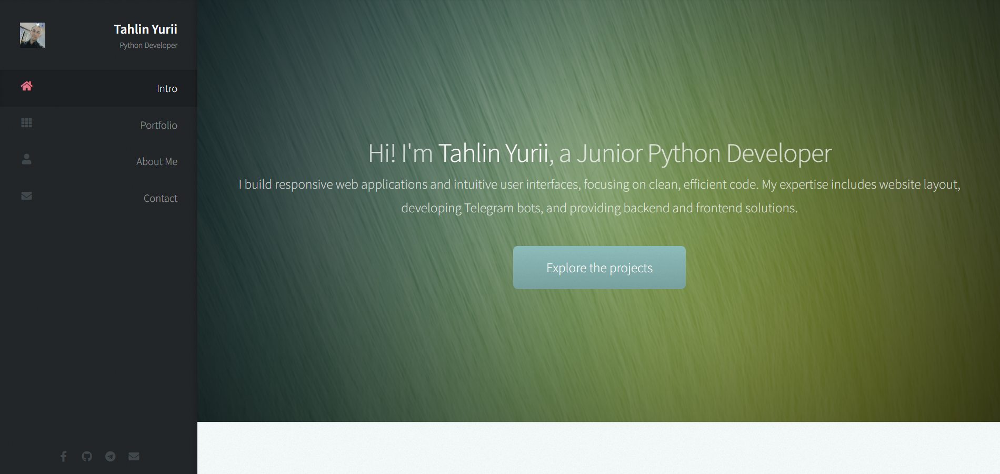
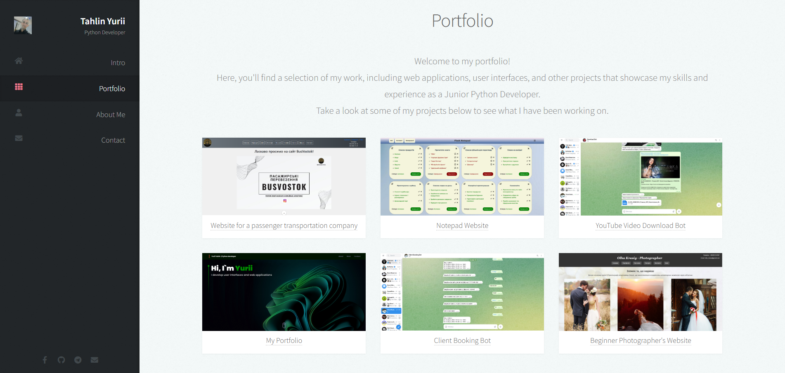
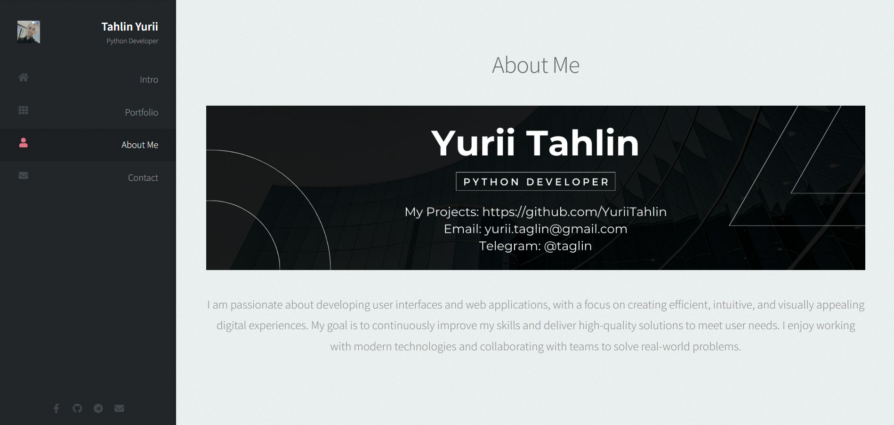
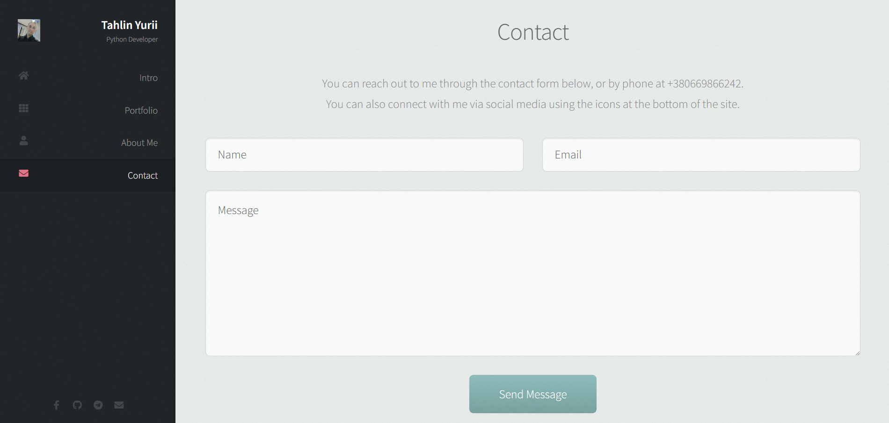
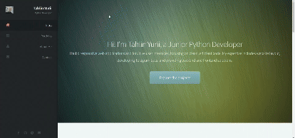

# Portfolio

Hi! I'm Tahlin Yurii, a Junior Python Developer. This is my portfolio showcasing user interface and web application projects.

## Table of Contents
- [Introduction](#introduction)

- [Installation](#installation)

- [Usage](#usage)

- [About Me](#about-me)

## Project Preview
You can explore the website by viewing the images and GIF below:

## Introduction
Welcome to my portfolio! Here, you can explore my various projects and see examples of my work in web development and Python programming.

## Installation
To set up and run this project locally, follow these steps: clone the repository, install dependencies: ensure you have all required packages listed in requirements.txt by running pip install -r requirements.txt. 
Run the application: Start the application with Flask using python app.py.

## Usage
Once the application is running, open a browser and navigate to http://127.0.0.1:5000 to explore the portfolio.

## About Me
In the portfolio, you can learn more about my background, experience, and skills as a Junior Python Developer. Feel free to connect with me for collaborations or project discussions.

Enjoy exploring the projects!